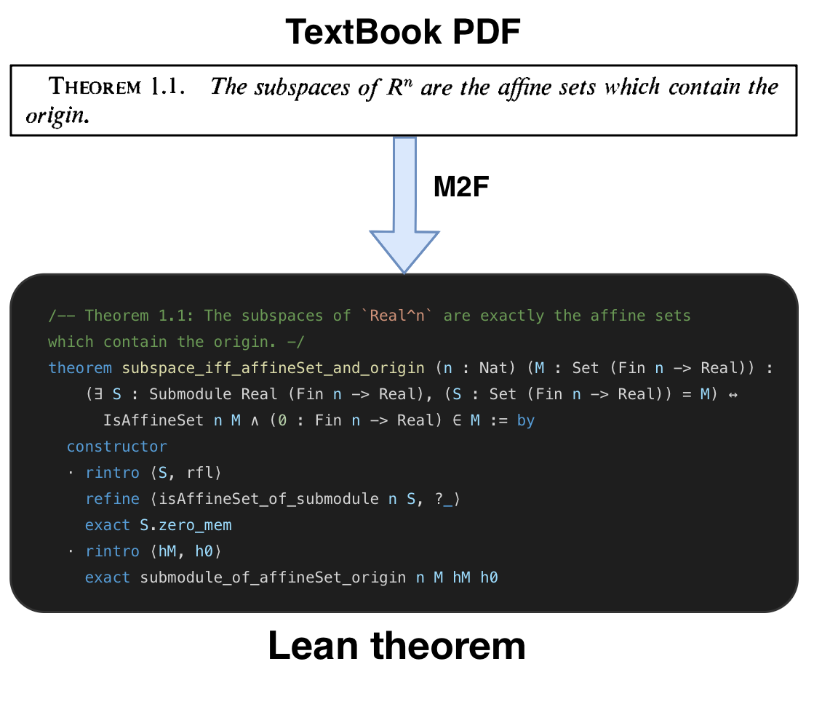
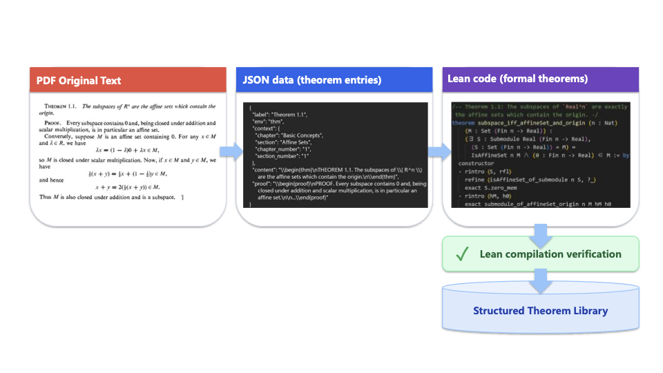

# M2F: Automated Formalization of Mathematical Literature at Scale

M2F (Math-to-Formal) is a framework for translating textbook- and paper-level mathematics into Lean projects that pass machine verification at scale.

## Abstract

M2F addresses a central bottleneck in machine-assisted mathematics: moving from isolated theorem proving to document-level formalization.  
The framework separates the workflow into two stages. Stage 1 compiles informal statements into Lean declaration skeletons and repairs structural inconsistencies. Stage 2 freezes statement signatures and focuses on proof completion through verifier-guided repair. This staged design improves stability, interpretability, and end-to-end pass rates.

## At a Glance

| Item | Value |
|---|---|
| Long-document corpus scale | **479 pages** |
| Generated Lean project size | **153,853 LoC** |
| Benchmark | **FATE-H (100 problems)** |
| Fully automatic setting | **96% PSR** |
| Light supervision (+31 declaration lemma map) | **97% PSR** |
| Stage 2 on matched statements (long-document setting) | **100% PSR** |

## Method

### Stage 1: Statement Compilation

- Converts informal mathematical statements into Lean declaration skeletons.
- Repairs namespace, type, and signature consistency to ensure project-level validity.
- Allows temporary proof holes to maximize structural coverage before proof repair.

### Stage 2: Proof Repair

- Freezes statement signatures to prevent target drift.
- Iteratively closes proof holes with verifier feedback.
- Optimizes proof success under fixed declarations for reliable end-to-end checking.

## Experimental Scope

- **Cross-prover benchmark:** FATE-H for direct and reproducible comparison of pass rates.
- **Long-document setting:** large mathematical sources translated into executable Lean projects.
- **Core metrics:** Pass Success Rate (PSR), verifier-call efficiency, and verifier-normalized cost.

## Result Highlights

### End-to-End System Figure

### System Pipeline

### Main Performance Charts

| FATE-H across provers (PSR) | FATE-H per-problem length and outcome |
|---|---|
|  |  |

### Additional Analyses

| Alignment analysis | Proof-flow example |
|---|---|
|  |  |

## Key Takeaways

- A staged compilation-repair pipeline scales formalization beyond isolated theorem tasks.
- M2F achieves strong fully automatic performance and further improves with lightweight supervision.
- Document-level formalization can reach high verifier pass rates under controlled, reproducible workflows.
