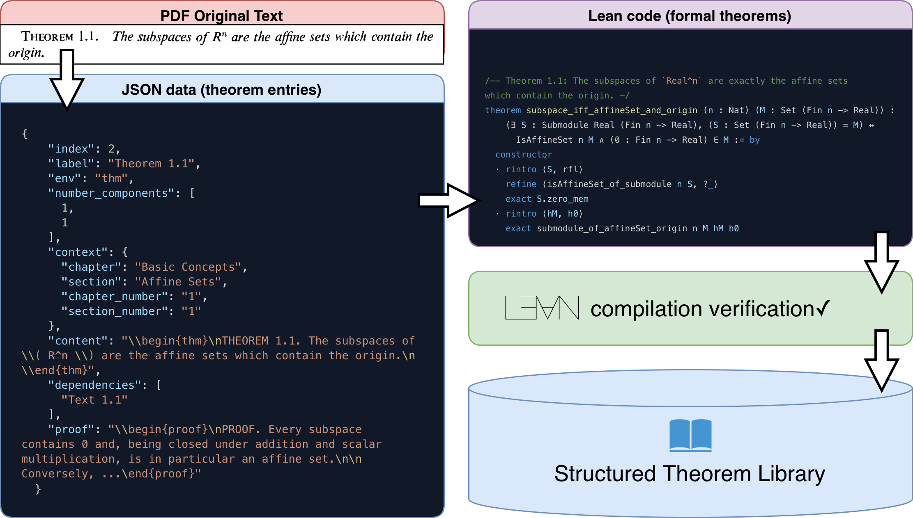
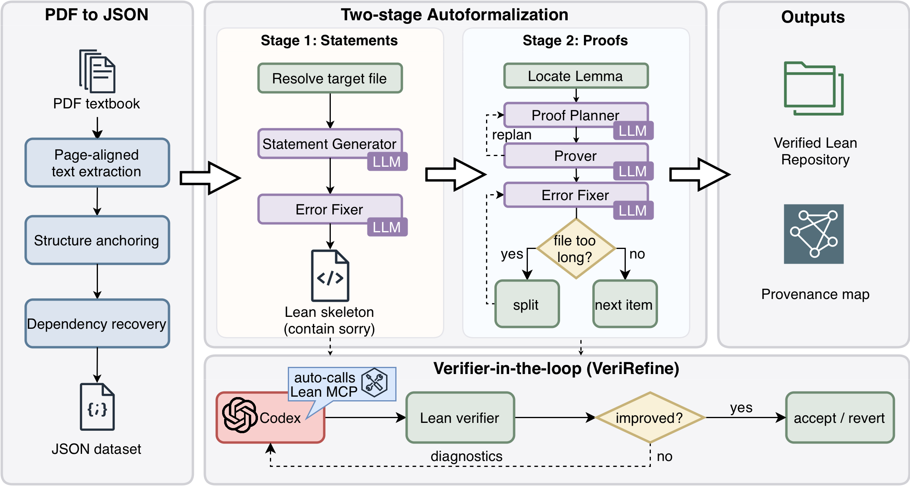
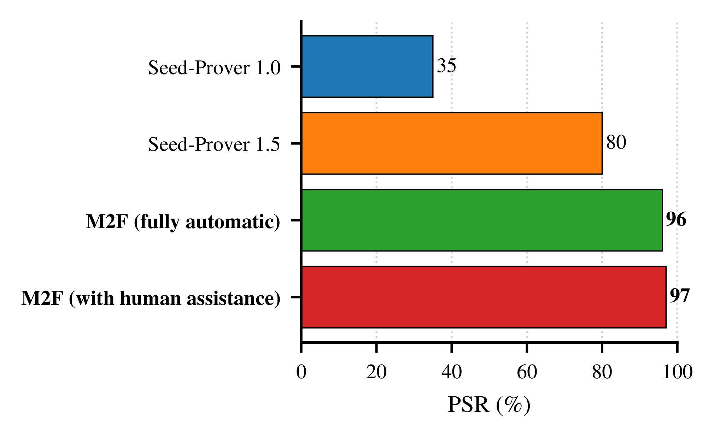
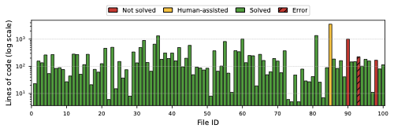
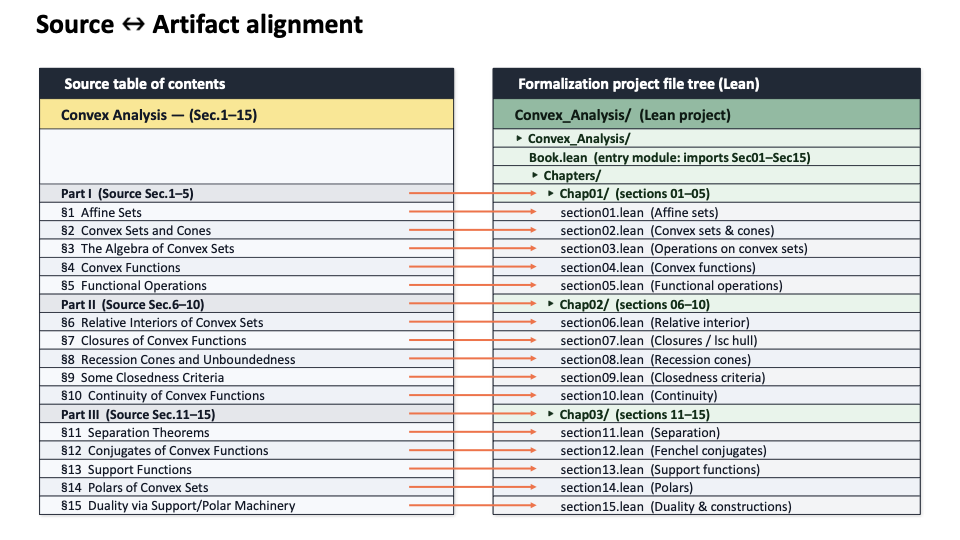

# M2F: Automated Formalization of Mathematical Literature at Scale

M2F (Math-to-Formal) is a framework for translating textbook- and paper-level mathematics into Lean projects that pass machine verification at scale.


*Figure 1. High-level overview of M2F and its staged formalization process.*

## Overview

M2F addresses a central bottleneck in machine-assisted mathematics: moving from isolated theorem proving to document-level formalization. The framework separates the workflow into two stages. Stage 1 compiles informal statements into Lean declaration skeletons and repairs structural inconsistencies. Stage 2 freezes statement signatures and focuses on proof completion through verifier-guided repair. This staged design improves stability, interpretability, and end-to-end pass rates.

## At a Glance

| Item | Value |
|---|---|
| Long-document corpus scale | **479 pages** |
| Generated Lean project size | **153,853 LoC** |
| Benchmark | **FATE-H (100 problems)** |
| Fully automatic setting | **96% PSR** |
| Light supervision (+31 declaration lemma map) | **97% PSR** |
| Stage 2 on matched statements (long-document setting) | **100% PSR** |

## Method

### Stage 1: Statement Compilation

- Converts informal mathematical statements into Lean declaration skeletons.
- Repairs namespace, type, and signature consistency to ensure project-level validity.
- Allows temporary proof holes to maximize structural coverage before proof repair.

### Stage 2: Proof Repair

- Freezes statement signatures to prevent target drift.
- Iteratively closes proof holes with verifier feedback.
- Optimizes proof success under fixed declarations for reliable end-to-end checking.

### End-to-End System Figure


*Figure 2. End-to-end architecture for document-level formalization with M2F.*

## Experimental Scope

- **Cross-prover benchmark:** FATE-H for direct and reproducible comparison of pass rates.
- **Long-document setting:** large mathematical sources translated into executable Lean projects.
- **Core metrics:** Pass Success Rate (PSR), verifier-call efficiency, and verifier-normalized cost.

## Example Demonstration

An end-to-end sample is provided in `example/` based on Section 1 (Affine Sets) of Rockafellar's convex analysis. The workflow in this example is:
`PDF source -> structured JSON -> Lean formalization`.

- **Structured source input (extracted from PDF):** `example/section01.json`
- **Generated Lean files:**
 `example/Rockafellar_convex_analysis_section01/section01_part1.lean`, `example/Rockafellar_convex_analysis_section01/section01_part2.lean`, `example/Rockafellar_convex_analysis_section01/section01_part3.lean`, `example/Rockafellar_convex_analysis_section01/section01_part4.lean`
- **Merged entry file:** `example/Rockafellar_convex_analysis_section01/section01.lean`
- **Reference generated Lean code:** [`optsuite/ReasBook/ReasBook`](https://github.com/optsuite/ReasBook/tree/main/ReasBook)

This example explicitly starts from PDF parsing output (`section01.json`) and then performs formalization from JSON to machine-checkable Lean code.

## Result Highlights

### Long-Document (Book) Extraction Summary

**Table 1. Book-level extraction and formalization summary (long-document setting).**

| Item | Value |
|---|---|
| Source domain | Textbook- and paper-level mathematical documents |
| Extraction/formalization pipeline | `PDF source -> structured JSON -> Lean formalization` |
| Long-document corpus scale | **479 pages** |
| Generated Lean project size | **153,853 LoC** |
| Stage 2 on matched statements | **100% PSR** |

### FATE-H Across Provers (PSR)


*Figure 4. Pass Success Rate (PSR) comparison across provers on FATE-H.*
[PDF version](figs/fateh_psr_bar_v4.pdf)

**Table 2. M2F summary results on FATE-H and matched-statement settings.**

| Condition | PSR |
|---|---|
| Fully automatic | **96%** |
| +31 declaration lemma map | **97%** |
| Stage 2 (matched statements) | **100%** |

### FATE-H Length and Outcomes


*Figure 5. Per-problem proof length and verification outcomes on FATE-H.*
[PDF version](figs/fateh_loc_bar_log_2col_en.pdf)

### Alignment Analysis


*Figure 6. Alignment behavior analysis under the convex setting.*

## Key Takeaways

- A staged compilation-repair pipeline scales formalization beyond isolated theorem tasks.
- M2F achieves strong fully automatic performance and further improves with lightweight supervision.
- Document-level formalization can reach high verifier pass rates under controlled, reproducible workflows.

## Contact

We hope that the package is useful for your application. If you have any bug reports or comments, please feel free to email one of the authors:

- Zichen Wang, zichenwang25 at stu.pku.edu.cn
- Wanli Ma, wlma at pku.edu.cn
- Kun Yuan, kunyuan at pku.edu.cn
- Zaiwen Wen, wenzw at pku.edu.cn

## Reference

[Zichen Wang, Wanli Ma, Zhenyu Ming, Gong Zhang, Kun Yuan, Zaiwen Wen, *M2F: Automated Formalization of Mathematical Literature at Scale*, arXiv:XXXX.XXXXX, 2026.](#citation)

## Citation

```bibtex
@article{wang2026m2f,
  title   = {M2F: Automated Formalization of Mathematical Literature at Scale},
  author  = {Zichen Wang and Wanli Ma and Zhenyu Ming and Gong Zhang and Kun Yuan and Zaiwen Wen},
  journal = {arXiv preprint arXiv:XXXX.XXXXX},
  year    = {2026}
}
```

## License

This repository is released under the `CC BY-NC 4.0` license  
(Creative Commons Attribution-NonCommercial 4.0 International).  
See the full terms in `LICENSE`.
